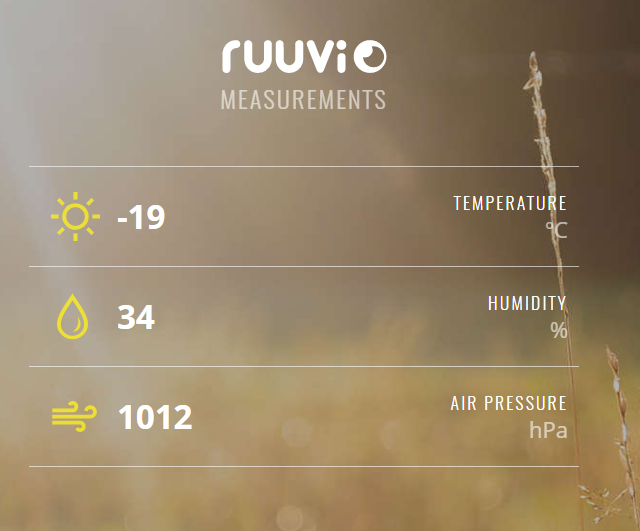

# Sensor Protocol for Eddystone-URL

This specification is designed to offer simple and flexible way to broadcast different type of sensor values in an [Eddystone-URL](https://github.com/google/eddystone/tree/master/eddystone-url) frame. One possible usage scenario would be:
> [RuuviTag](http://ruuvitag.com) sensor beacon broadcasts an encoded URL address in an Eddystone-URL frame: `http://ruu.vi#AjAYAMLs`. Once user visits the link, **ruu.vi** website decodes the value `AjAYAMLs` and shows the data in a human-readable format.  Please note that ruu.vi website rounds the data. 
The website implemetation is online at it's own [github repository](https://github.com/ruuvi/weather-station-serverside).

The data part of the URL can be encoded in firmware of the beacon. The most powerful way to encode the data would be Base94 because the URL field of the Eddystone-URL has a support for 94 different characters. Normally it's mandatory to encode the data because of maximum length (18 characters) of the [Eddystone-URL](https://github.com/google/eddystone/tree/master/eddystone-url) frame's URL field. We are using [URL-safe Base64](https://tools.ietf.org/html/rfc4648#page-7) for support across as many devices as possible.

## Protocol Specification (Data Format 2 and 4)

The decoded data URL parameter is a packet of bytes.

Offset | Allowed values | Description
-----|:-----:|-----------
 0 | 4 | Data format definition (4 = current sensor readings)
 1 | `0 ... 200` | Humidity (one lsb is 0.5%, e.g. 128 is 64%)
 2 | `-127 ... 127, signed` | Temperature (MSB is sign, next 7 bits are decimal value)
 3 | `0 ... 0` | Temperature (fraction, 1/100.). Not used, reads always as 0.
 4 - 5| `0 ... 65535` | Pressure (Most Significant Byte first, value - 50kPa). Rounded to 1 hPa accuracy.
 6 | `0..255` | Random id of tag, only present in format 4. NOTE! because of the URL limitation, only 6 most significant bits will be readable. 

## Protocol Specification (Data Format 3)
The data is decoded from "Manufacturer Specific Data" -field, for more details please check [this article](http://www.argenox.com/a-ble-advertising-primer/) out.
Manufacturer ID is 0x0499. 
The actual data payload is: 

Offset | Allowed values | Description
-----|:-----:|-----------
 0 | 3 | Data format definition (3 = current sensor readings)
 1 | `0 ... 200` | Humidity (one lsb is 0.5%, e.g. 128 is 64%)
 2 | `-127 ... 127, signed` | Temperature (MSB is sign, next 7 bits are decimal value)
 3 | `0 ... 99` | Temperature (fraction, 1/100.)
 4 - 5| `0 ... 65535` | Pressure (Most Significant Byte first, value - 50kPa)
 6-7 | `-32767 ... 32767, signed`  | Acceleration-X (Most Significant Byte first)
 8 - 9 | `-32767 ... 32767, signed`  | Acceleration-Y (Most Significant Byte first)
 10 - 11| `-32767 ... 32767, signed`  | Acceleration-Z (Most Significant Byte first)
 12 - 13| `0 ... 65535` | Battery voltage (millivolts). MSB First

### Data field descriptions 
#### Temperature formats 
Values supported: -127.99 °C to +127.99 °C in 0.01 °C increments.

_Example_ 

Value | Measurement
----|-----------
 `0x0000` | 0 °C
 `0x8145` | -1.69 °C
 `0x0145` | +1.69 °C

#### Humidity
Values supported: 0.0 % to 100 % in 0.5 % increments.

_Example_

Value | Measurement
----|-----------
 `000` | 0%
 `128` | 64.0%
 `200` | 100.0%

#### Atmospheric Pressure
Values supported: 50000 Pa to 115536 Pa in 1 Pa increments.

_Example_

Value | Measurement
----|-----------
 `00000` | 50000 Pa
 `51325` | 101325 Pa (average sea-level pressure)
 `65536` | 115536 Pa
 
#### Acceleration
Values supported: -32000 to 32000 (mG), however the sensor on RuuviTag supports only 16 G max (2 G in default configuration).
Values are 2-complement int16_t, MSB first. All channels are identical.

_Example_

Value | Measurement
----|-----------
 `0xFC 0x18` | -1000 mG
 `0x03 0xE8` | 1000 mG

#### Battery voltage
Values supported: 0 mV to 65536 mV in 1 mV increments, practically 1800 ... 3600 mV. 

#### Tag ID
Contains a single random base 64 character used to identify tag.
 
#### Data Format
The first byte tells the receiver (ie. website) what kind of type of data the packet has.

Decimal | Description
----|-----------
 1 | Historical use, not supported anymore. 
 2 | Eddystone-URL, URL-safe base64 -encoded, kickstarter edition (no battery voltage)
 3 | BLE Manufacturer specific data, all current sensor readings at 1 second interval. Used by Ruuvi firmware v1.
 4 | Eddystone-URL, URL-safe base64 -encoded, with tag id. Used by Ruuvi firmwares v1 and v2. 
 5 | Raw v2, used by Ruuvi firmware v2
 6 | Reserved for future use
 7 | Reserved for future use
 8 | Reserved for future use
 9 | Reserved for future use
 10| Reserved for future use
 11| Reserved for future use
 12| Reserved for future use
 13| Reserved for future use
 14| Reserved for future use
 15| Reserved for future use
 `16 ... 239`| Reserved for bidirectional communication
 `240 ... 255`| Reserved for custom applications. 

## Protocol Specification (Data Format 5)
This is update to format 3 which increases resolution of temperature and humidity. It also adds BLE power information, activity detection, packet counter. It also adds MAC address of sender for iOS devices. "Not available" constants are also defined.

The data is decoded from "Manufacturer Specific Data" -field, for more details please check [this article](http://www.argenox.com/a-ble-advertising-primer/) out.
Manufacturer ID is 0x0499. 
The actual data payload is: 

Offset | Allowed values | Description
-------|:--------------:|-----------
0      | `5`            | Data format (8bit)
1-2    | `-32767 ... 32767` |Temperature in 0.005 degrees
3-4    | `0 ... 40 000`  | Humidity (16bit unsigned) in 0.0025% (0-163.83% range, though realistically 0-100%)
5-6    | `0 ... 65534` |   Pressure (16bit unsigned) as it is in format 3
7-8    | `-32767 ... 32767`  | Acceleration-X (Most Significant Byte first)
9-10   | `-32767 ... 32767`  | Acceleration-Y (Most Significant Byte first)
11-12  | `-32767 ... 32767`  | Acceleration-Z (Most Significant Byte first)
13-14  | `0 ... 2047`, `0 ... 31` | Power info (11+5bit unsigned), first 11bits unsigned is the battery voltage above 1.6V, in millivolts (1.6V to 3.647V range). last 5 bits unsigned is the TX power above -40dBm, in 2dBm steps. (-40dBm to +24dBm range)
15     | `0 ... 255`| Movement counter (8bit unsigned), incremented by motion detection interrupts from LIS2DH12
16-17  | `0 ... 65534`| Measurement sequence number (16bit unsigned), each time a measurement is taken, this is incremented by one, used for measurement de-duplication (depending on the transmit interval, multiple packets with the same measurements can be sent, and there may be measurements that never were sent)
18-23  | `Any valid mac` | 48bit MAC address. 

_Not available_ is signified by largest presentable number for unsigned values, smallest presentable number for signed values and all bits set for mac. 

### Data field descriptions 
#### Temperature formats 
Values supported:  (-163.84 °C to +163.83 °C in 0.005 °C increments.

_Example_ 

Value | Measurement
----|-----------
 `0x0000` | 0 °C
 `0x01C3` | +2.255 °C
 `0xFE3D` | -2.255 °C
 `0x8000` | Invalid / not available

#### Humidity
Values supported: 0.0 % to 100 % in 0.0025 % increments.

_Example_

Value | Measurement
----|-----------
 `000` | 0%
 `10010` | 25.050%
 `40000` | 100.0%
 `65535` | Invalid / not available

#### Atmospheric Pressure
Values supported: 50000 Pa to 115536 Pa in 1 Pa increments.

_Example_

Value | Measurement
----|-----------
 `00000` | 50000 Pa
 `51325` | 101325 Pa (average sea-level pressure)
 `65534` | 115534 Pa
 `65535` | Invalid / not available
 
#### Acceleration
Values supported: -32000 to 32000 (mG), however the sensor on RuuviTag supports only 16 G max (2 G in default configuration).
Values are 2-complement int16_t, MSB first. All channels are identical.

_Example_

Value | Measurement
----|-----------
 `0xFC18` | -1000 mG
 `0x03E8` | 1000 mG
 `0x8000` | Invalid / not available

#### Battery voltage
Values supported: 1600 mV to 3647 mV in 1 mV increments, practically 1800 ... 3600 mV.

_Example_

Value | Measurement
----|-----------
 `0000` | 1600 mV
 `1400` | 3000 mV
 `2048` | Invalid / not available

#### Tx Power
Values supported: -40 dBm to +22 dBm in 2 dBm increments.

_Example_

Value | Measurement
----|-----------
 `00` | -40 dBm
 `22` | +4 dBm
 `32` | Invalid / not available

#### Movement counter
Movement counter is one-byte counter which gets triggered when LIS2DH12 give "activity interrupt". 
The counter will roll over. Movement is deduced by "rate of change"

_Example_

Value | Measurement
----|-----------
 `00` | 0 counts
 `100` | 100 counts
 `255` | Invalid / not available

#### Measurement sequence number
Mesurement sequence number gets incremented by one for every measurement. 
It can be used to gauge signal quality and packet loss as well as to deduplicated data entries.

_Example_

Value | Measurement
----|-----------
 `00` | 0 counts
 `1000` | 1000 counts
 `65535` | Invalid / not available

#### Data Format
The first byte tells the receiver (ie. website) what kind of type of data the packet has.

Decimal | Description
----|-----------
 1 | Historical use, not supported anymore. 
 2 | Eddystone-URL, URL-safe base64 -encoded, kickstarter edition (no battery voltage)
 3 | BLE Manufacturer specific data, all current sensor readings at 1 second interval. Used by Ruuvi firmware v1.
 4 | Eddystone-URL, URL-safe base64 -encoded, with tag id. Used by Ruuvi firmwares v1 and v2. 
 5 | Raw v2, used by Ruuvi firmware v2
 6 | Reserved for future use
 7 | Reserved for future use
 8 | Reserved for future use
 9 | Reserved for future use
 10| Reserved for future use
 11| Reserved for future use
 12| Reserved for future use
 13| Reserved for future use
 14| Reserved for future use
 15| Reserved for future use
 16 ... 239| Reserved for bidirectional communication
 240 ... 255| Reserved for custom applications. 
